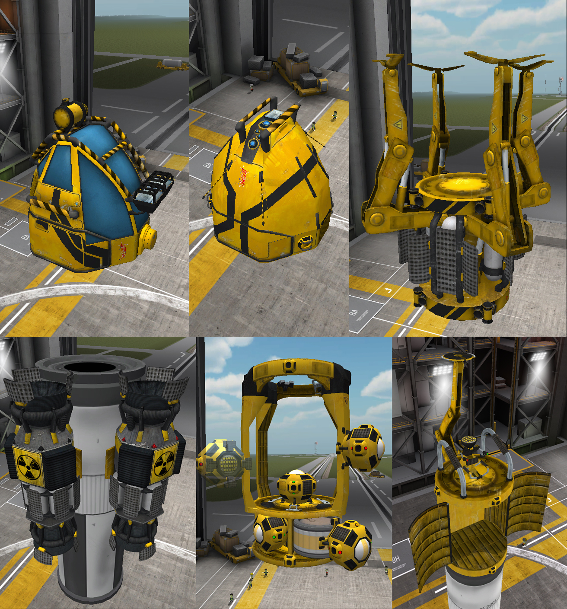

# Orbital-Utility-Vehicle---Continued

## Do not use any grappler parts as vessel Root. 

**Command Pod**, roughly same size as Mk1; will work on IVA when I get my hands on the new PartTools. Now has data transmitter built-in. Two variants depending on other active mods.

- **KAS**: adds front mounted winch unit w 30 meter cable. Size slightly reduced, Increased ejection force. No more harpoon bouncing off of asteroids.
- **SCANSat**: adds small SCANSat network uplink unit w/ BTDT scanner.
- **FStextureSwitch2**: for some visual customization options.

**Advanced Drone Unit**, derived from the Command Pod. Crew space converted to service bay. More EC and Mono capacity. Integrated RCS thrusters. One variant available

- **RemoteTech**: Service bay removed. Adds 500km passive Omni antenna and 9Mm directional antenna, should allow comfortable operation within Kerbin SOI. Increased EC and Mono capacity. Integral RTG

**Grappler unit**, very handy for moving things around when you don't have a docking port. Strong SAS and RCS thrusters. Moderate EC capacity and LF/OX, LF,  or Mono fuel options. Reduced SAS power to 20; Max RCS power increased to 15 with default RCS thrust set to 5%.

**Radial NV engine**, burns LF/OX or Mono. Reversible thrust. Full extension to around 2m, a tad shorter than the FT400 fuel tank. can give you that extra clearance you need when hauling large objects. Keep Kerbals away from moving parts. Fixed reverse thrust. added thrust Gimbal. now with KSPI-E config. wide range of characteristics depending on fuel type. Added Indicator for reverse thrust mode.

**Helper Drone**, small remote controlled RCS block with integrated light and RTG. Max RCS thrust of 8 w/ default thrust at 10% max. Minimal SAS.  Use grabber to dock after initial separation.

- 3km omni antenna if using *RemoteTech*.

**Adaptor Carrier**, same dimensions as Push Adaptor but fitted with higher capacity Mono tank and compartments for up to 4 Helper Drones. Grabber unit only. Will replace Push Adaptor part in future. Fixed collider boxes so you don't get stuck grabbing on to Size 1 Docking port when you get perfect alignment. Added orientation indicators and switcher. Red-Left, Green-Right, Yellow-Up.

**Push Adaptor/Service Bay**, Grabber/DockingPort/Service Bay. Service Bay replaced by KIS container if you run KIS.

**Grappler Jr.**, Grappler arm w/ Service Bay, integrated external command seat. Service Bay replaced with KIS container if KIS is installed. I don't know what it's good for... Jeb made me do it.

 This work is licensed under a <a rel="license" href="http://creativecommons.org/licenses/by-nc-sa/4.0/">Creative Commons Attribution-NonCommercial-ShareAlike 4.0 International License</a>.

With attribution to the original author **_Nli2work_** for his mod "_Orbital Utility Vehicle_".

Which can be found here: https://forum.kerbalspaceprogram.com/index.php?/topic/133162-112-orbital-utility-vehicle-v124/&

### Required Dependancies:

ModuleManager: https://forum.kerbalspaceprogram.com/index.php?/topic/50533-131-module-manager-301-dec-6th-2017-early-christmas-gift/

### Supported (optional):

**KAS**: https://forum.kerbalspaceprogram.com/index.php?/topic/142594-131-kerbal-attachment-system-kas-v063/

**KIS**: https://forum.kerbalspaceprogram.com/index.php?/topic/149848-131-kerbal-inventory-system-kis-v18/

**SCANsat**: https://forum.kerbalspaceprogram.com/index.php?/topic/72679-13x-scansat-v182-real-scanning-real-science-at-warp-speed-november-22-2017/

**RemoteTech**: https://forum.kerbalspaceprogram.com/index.php?/topic/139167-131-remotetech-v189-2017-11-11/

**KSPInterstellarExtended**: https://forum.kerbalspaceprogram.com/index.php?/topic/155255-131-ksp-interstellar-extended-kspie-1165-26-12-2017-support-release-thread/

**FireSpitter**: https://forum.kerbalspaceprogram.com/index.php?/topic/22583-firespitter-propeller-plane-and-helicopter-parts-v71-may-5th-for-ksp-10/
